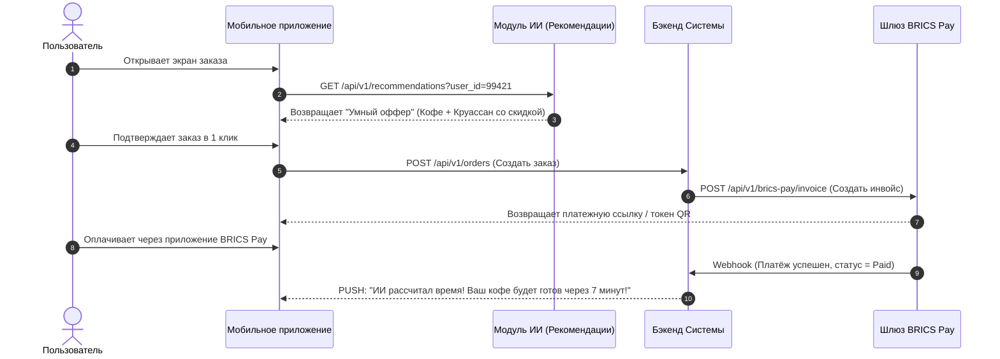

# Кейс №1: Модернизация ИТ-архитектуры кофейни (Интеграция ИИ и BRICS Pay)

Этот кейс демонстрирует сквозное проектирование инновационной системы онлайн-предзаказа кофе через декомпозицию требований под тремя углами обзора: Владельца бизнеса, Пользователя и Системного аналитика, с интеграцией ИИ-агента и трансграничного платежного протокола BRICS Pay.

---

## 🪙 1. Взгляд Владельца Бизнеса (Бизнес-требования — BR)
*   **BR-01 (Оптимизация трафика):** Сократить очереди у кассы в утренние часы пик (08:00–10:00) на 35% за счет перевода клиентов на предоплаченные онлайн-заказы.
*   **BR-02 (ИИ-генерация выручки):** Повысить средний чек на 22% за счет внедрения рекомендательного ИИ-модуля умных допродаж (Cross-sell), обучающегося на истории покупок конкретного клиента.
*   **BR-03 (Финтех-диверсификация):** Снизить издержки на эквайринг и подключить новую платежеспособную аудиторию за счет интеграции децентрализованной платежной системы **BRICS Pay** (оплата по QR-кодам и бесконтактным токенам).

---

## ☕ 2. Взгляд Клиента / Пользователя (Пользовательские требования — UR)
*   **UR-01 (ИИ-бариста):** Я как *клиент* хочу, чтобы приложение при открытии само предлагало мне мой любимый утренний рецепт (например, "Двойной латте на кокосовом без сахара") на основе погоды, дня недели и моих привычек, чтобы я оформлял заказ в 1 клик.
*   **UR-02 (Инновационная оплата):** Я как *прогрессивный пользователь* хочу мгновенно оплачивать предзаказ через систему **BRICS Pay** (по QR или биометрии), не переживая из-за блокировок международных платежных систем.
*   **UR-03 (Динамический тайм-менеджмент):** Я как *спешащий сотрудник* хочу, чтобы ИИ рассчитывал точное время готовности кофе с учетом пробок на моем маршруте, чтобы я забирал напиток идеально горячим.

---

## 🧠 3. Взгляд Системного Аналитика (Системная архитектура, API и Логика ИИ)
Системный аналитик связывает цели бизнеса, ИИ-модели и платежные шлюзы в единую отказоустойчивую архитектуру.

### 🔄 Схема взаимодействия компонентов (Traceability & Integration)



### 🔌 Интеграционный API-контракт создания заказа (JSON Specs)

Запрос от приложения к бэкенду. Обратите внимание на поле `payment_gateway` со значением `brics_pay` и токен, сгенерированный ИИ-моделью для подтверждения того, что пользователь согласился на предложенную ИИ допродажу (`ai_recommendation_token`):

```json
{
  "order_metadata": {
    "user_id": 99421,
    "coffee_shop_id": 7,
    "payment_gateway": "brics_pay",
    "currency": "RUB"
  },
  "cart_items": [
    { "product_id": 101, "name": "Латте Кокос", "quantity": 1, "modifiers": ["no_sugar"] },
    { "product_id": 505, "name": "Круассан классический", "quantity": 1, "is_ai_suggested": true }
  ],
  "ai_analytics": {
    "ai_recommendation_token": "ai_recom_99f82c41aa0e",
    "predicted_prep_time_seconds": 420
  }
}
```

### 🗄 Структура Базы Данных (Фрагмент ER-модели)
Для поддержки финтеха и аналитики ИИ в БД расширяется сущность заказов:
*   `brics_pay_tx_id` (varchar, Unique) — Уникальный хэш транзакции в блокчейн-контуре / клиринговой сети BRICS Pay для проведения сверки.
*   `ai_conversion_flag` (boolean) — Метка для аналитиков данных (Data Scientists), сработала ли ИИ-рекомендация (нужно для дообучения модели).
