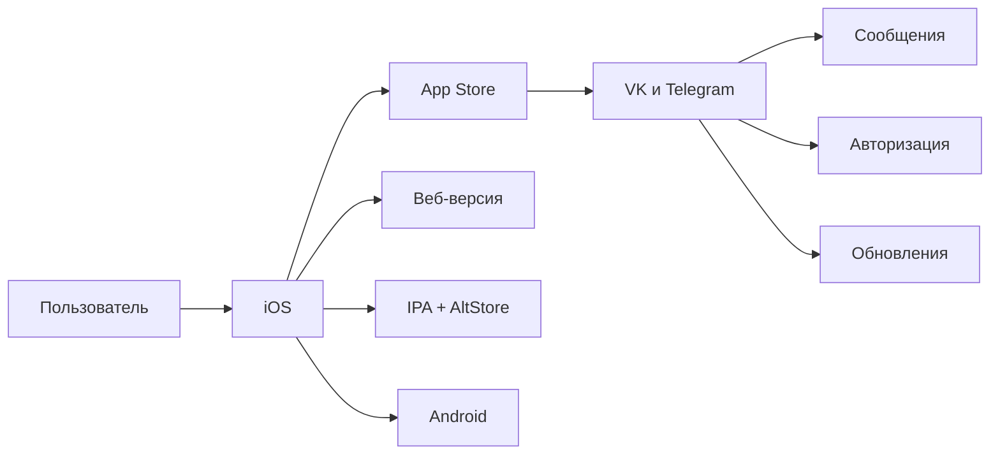

# 🧩 Анализ экосистемных рисков: удаление VK и Telegram из App Store

> **Системный аналитический обзор зависимости цифровой инфраструктуры от внешних платформ**

---

## 📌 1. Контекст проблемы

В 2026 году приложения VK и Telegram были удалены из App Store.  
Миллионы пользователей в России столкнулись с невозможностью установить или обновить приложения.

Это не просто технический сбой — это **системный риск**, затрагивающий:

- Коммуникации (VK, Telegram)
- Авторизацию (VK ID)
- Обновления безопасности
- Платежи и подписки

---

## 📊 2. Масштаб влияния (расчёты)

| Показатель | Значение | Источник / обоснование |
|---|---|---|
| Пользователи iPhone в РФ | ~15 млн | Данные 2025–2026 |
| Активные пользователи VK на iOS | ~8–10 млн | Оценка на основе аудитории |
| Активные пользователи Telegram на iOS | ~5–7 млн | Оценка на основе аудитории |
| Потенциально затронуты | **до 12 млн человек** | Без возможности установить/обновить |

**Расчёт потерь:**

| Сценарий | Потери (млн руб./мес.) |
|---|---|
| Потеря рекламного трафика | ~500–700 |
| Снижение вовлечённости пользователей | ~200–300 |
| Переход на альтернативные платформы | ~100–200 |
| **ИТОГО** | **~1 млрд руб./мес.** |

---

## 🧭 3. Сценарии развития событий

| Сценарий | Описание | Вероятность | Влияние |
|---|---|---|---|
| 🌱 **Оптимистичный** | Появляется российский магазин приложений, VK возвращается через него | Средняя | Снижение риска |
| ⚖️ **Базовый** | Пользователи переходят на веб-версии и Android | Высокая | Частичная потеря аудитории |
| 🔥 **Кризисный** | Блокируется и Google Play, происходит массовый отток пользователей iOS | Низкая | Критическое влияние |

---

## 🗺️ 4. Прогнозная карта рисков

```mermaid
flowchart TD
    A[Удаление VK и Telegram из App Store]
    A --> B[Потеря доступа к установке]
    A --> C[Потеря обновлений]
    A --> D[Потеря авторизации через VK ID]

    B --> E[Переход на Web или PWA]
    B --> F[Переход на Android]
    B --> G[Использование IPA и AltStore]

    C --> H[Уязвимости безопасности]
    C --> I[Ошибки в работе приложений]

    D --> J[Сбой входа в сторонние сервисы]

    E --> K[Ухудшение UX]
    F --> L[Смена устройства]
    G --> M[Сложность для обычных пользователей]

    K & L & M --> N[Снижение лояльности пользователей]
    N --> O[Переход на альтернативные сервисы]
📈 5. График изменения пользовательской базы (прогноз)

```mermaid
timeline
    title Прогноз изменения пользователей iOS в РФ
    2026-01 : 15 млн пользователей
    2026-06 : Удаление VK и Telegram из App Store
    2026-12 : 8-10 млн останутся
    2027-06 : 6-8 млн (с учётом оттока)
```

---

🧭 6. Инструкция для пользователя: как восстановить доступ

✅ Веб-версия (быстро и без установки)

Шаг Действие
1 Открой браузер (Safari, Chrome, Firefox)
2 Перейди на m.vk.com или web.telegram.org
3 Войди по логину и паролю
4 Добавь ярлык на главный экран

✅ Плюсы: бесплатно, без установки
❌ Минусы: нет push-уведомлений

---

✅ Установка через альтернативный магазин (AltStore)

Шаг Действие
1 Скачай AltStore с официального сайта
2 Установи через компьютер (требуется USB)
3 Добавь репозиторий с IPA-файлами VK и Telegram
4 Установи приложение
5 Обновляй подпись каждые 7 дней

✅ Плюсы: полноценное приложение
❌ Минусы: сложно для обычного пользователя

---

✅ Переход на Android (кардинальное решение)

Шаг Действие
1 Используй Android-устройство для VK и Telegram
2 Все приложения доступны в Google Play
3 Также доступны альтернативные магазины (RuStore, Galaxy Store)

✅ Плюсы: полная свобода
❌ Минусы: смена устройства

---

✅ Альтернативные сервисы (на случай блокировки)

Сервис Замена
VK Telegram-каналы, Yappy, Телеграм-чаты
Telegram VK Мессенджер, Signal, WhatsApp

---

💡 7. Выводы системного аналитика

· iOS — единая точка отказа для миллионов пользователей
· Android и Web — альтернативные каналы, снижающие зависимость
· Децентрализация — ключевой принцип устойчивости цифровых систем
· Российские ОС и магазины — долгосрочная стратегия

---

📎 Приложение: карта зависимостей



---

Кейс выполнен в рамках обучения САС-101
📅 Последнее обновление: 2026-06-29 21:06:49
